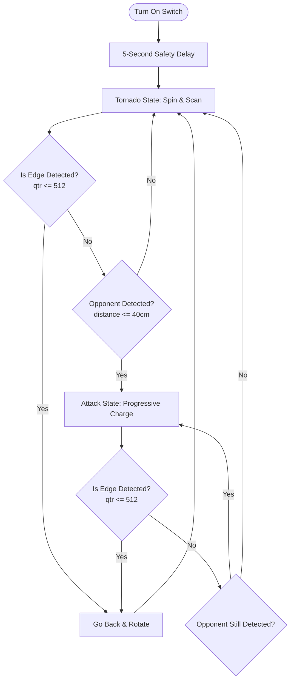

# 🏆 2023 1st Place Division Champion: 500g Autonomous Sumo Robot (RIZAL)

This repository archives the official Arduino firmware (`compe.ino`) for our **500-gram Autonomous Sumo Robot**, representing **Rizal National Science High School (RNSHS)**. Developed as a collaborative team effort, this robot won **1st Place** in its division at the **2023 Division School Science and Technology Fair**.

The robot is engineered to detect opponent robots using an infrared distance sensor, aggressively charge them using a progressive speed algorithm, and stay within the playing ring (*dohyo*) by detecting the white border line using a reflectance sensor.

> [!NOTE]
> **Project Notice:** This repository serves as an archive for historical and documentation purposes. This was a collaborative team effort by the project members from Rizal National Science High School.

---

## 🛠️ Hardware Specifications

### 1. Control & Processing
* **Microcontroller:** Arduino Nano - Provides compact, reliable processing with plenty of analog input pins.
* **Motor Driver:** L298N Dual H-Bridge Motor Driver Module - Handles high current to drive both DC gear motors with PWM speed control.

### 2. Sensors
* **Opponent Detection:** Sharp GP2Y0A41SK0F (or similar) Infrared Distance Sensor - Analog range detection from **4cm to 30cm/40cm**.
* **Edge/Line Detection:** QTR-1A Reflectance Sensor - Analog infrared emitter/receiver pair used to distinguish between the black dohyo surface and the white border.

### 3. Chassis & Mechanics
* **Main Body:** Custom-fabricated **flattened PVC**. Created by heating and flattening PVC piping to make a tough, impact-resistant, and lightweight chassis under the 500g limit.
* **Front Wedge / Scraper:** Low-profile front scraper scoop. Designed to get underneath the opponent robot's chassis, lifting their wheels off the ring to break their traction.

### 4. Power System
* **Motor Power:** Tattu R-Line 7.4V 550mAh 2S LiPo Battery - Delivers high discharge rates and punchy torque to the drive motors.
* **Logic Power:** 9V Alkaline Battery - Powers the Arduino Nano separately via `VIN` to prevent motor noise and voltage drops (brownouts) from resetting the microcontroller.

### 5. Prototyping & Wiring
* Small solderless breadboard for distribution.
* SPST Toggle/Slide switches for battery isolation.
* DuPont jumper wires (Female-to-Female, Female-to-Male, and Male-to-Male).

---

## 🔌 Pin Mapping & Wiring Guide

To ensure high reliability during high-impact matches, follow this wiring scheme:

### Microcontroller Connections
...
<!-- | Arduino Nano Pin | Connected To | Description | Direction |
| :--- | :--- | :--- | :--- |
| **A0** | Sharp IR Sensor (Signal) | Opponent detection analog input | Input |
| **A2** | QTR-1A Sensor (Signal) | Border line detection analog input | Input |
| **D5** | L298N Motor Driver **ENA** | PWM speed control (Left Motor) | Output |
| **D6** | L298N Motor Driver **IN1** | Direction control pin 1 (Left Motor) | Output |
| **D7** | L298N Motor Driver **IN2** | Direction control pin 2 (Left Motor) | Output |
| **D8** | L298N Motor Driver **IN3** | Direction control pin 1 (Right Motor) | Output |
| **D9** | L298N Motor Driver **IN4** | Direction control pin 2 (Right Motor) | Output |
| **D10** | L298N Motor Driver **ENB** | PWM speed control (Right Motor) | Output | -->

### Power & Ground Connections
...
<!-- 1. **Common Ground:** Connect the `GND` of the Arduino Nano, the negative (`-`) terminal of the 9V battery, the negative terminal of the 7.4V LiPo battery, the `GND` pin of the L298N driver, and all sensor grounds together. 
2. **Logic Power:** Connect the 9V battery positive terminal to the Arduino Nano `VIN` pin (through a power switch).
3. **Motor Power:** Connect the 7.4V LiPo battery positive terminal to the L298N `12V` input terminal (through a power switch).
4. **Sensor VCC:** Connect the `VCC` of both the Sharp IR sensor and the QTR-1A sensor to the Arduino Nano `5V` output pin. -->

---

## 🧠 Control Logic & State Machine

The robot operates as an autonomous state machine that prioritizes **self-preservation (edge avoidance)** over **offense (opponent attacking)**.

### 1. Match Start Safety Delay
Sumo rules dictate a **5-second delay** after activation before movement begins. This is implemented in `setup()` via `delay(5000);`.

### 2. Tornado State (Scan/Search)
If no opponent is detected, the robot enters the `tornado()` loop, spinning slowly in place (`speed = 70`) to scan the arena.

### 3. Attack State (Progressive Shoving)
When the Sharp IR sensor measures an opponent within **40cm**, the robot charges forward. The charge speed scale is adaptive to ensure maximum traction and impact:
* **Distance > 30cm and ≤ 40cm:** Creep forward cautiously at speed **90/255**.
* **Distance > 15cm and ≤ 30cm:** Accelerate to speed **130/255** to close the gap.
* **Distance ≤ 15cm:** Execute a full charge at maximum speed **255/255** to push the opponent out.

### 4. Edge Escape State (Self-Preservation)
If the QTR-1A reflectance sensor detects the white ring border (reading drops below the **512 threshold**), the robot overrides all attack behaviors:
1. Instantly triggers `goBack()` at speed **200/255** for **250ms**.
2. Executes `rotate()` at speed **120/255** to turn away from the edge and face back toward the center of the ring.

---

## 💻 How to Compile and Upload using Arduino IDE

### Prerequisites
* **Arduino IDE:** Download and install the latest version of the [Arduino IDE](https://www.arduino.cc/en/software).
* **Driver (if using Nano clones):** Most budget Arduino Nano boards use the **CH340G** USB-to-Serial chip. If your computer does not recognize the board, download and install the CH340 drivers.

### Upload Steps
1. Clone or download this project folder.
2. Open the [compe.ino](file:///Users/vince/Downloads/compe/compe.ino) file in Arduino IDE.
3. Connect your Arduino Nano to your computer using a Mini-USB cable.
4. Set up the board configurations in Arduino IDE:
   * Go to **Tools > Board > Arduino AVR Boards** and select **Arduino Nano**.
   * Go to **Tools > Processor** and select **ATmega328P** (or **ATmega328P (Old Bootloader)** if you encounter an upload error).
   * Go to **Tools > Port** and select the active COM/Serial port matching your Nano.
5. Click the **Verify** button (checkmark icon) to compile and check for errors.
6. Click the **Upload** button (arrow icon) to program the board.
7. Disconnect the USB cable, assemble your robot, place it in the center of the dohyo, flip the switches, and watch it win!
